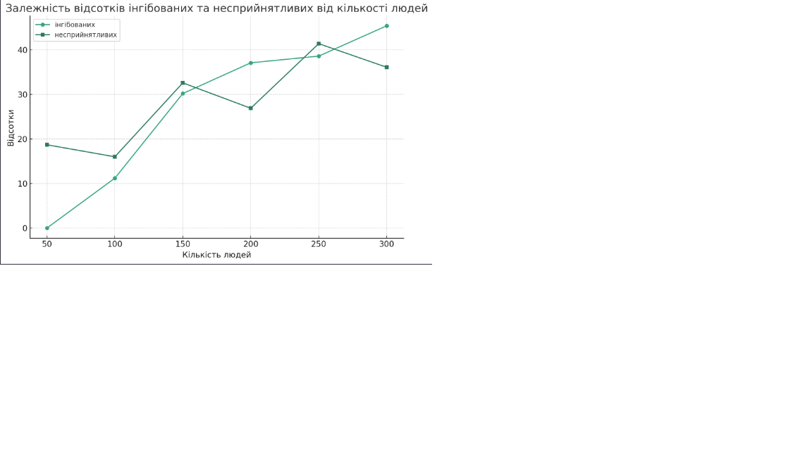
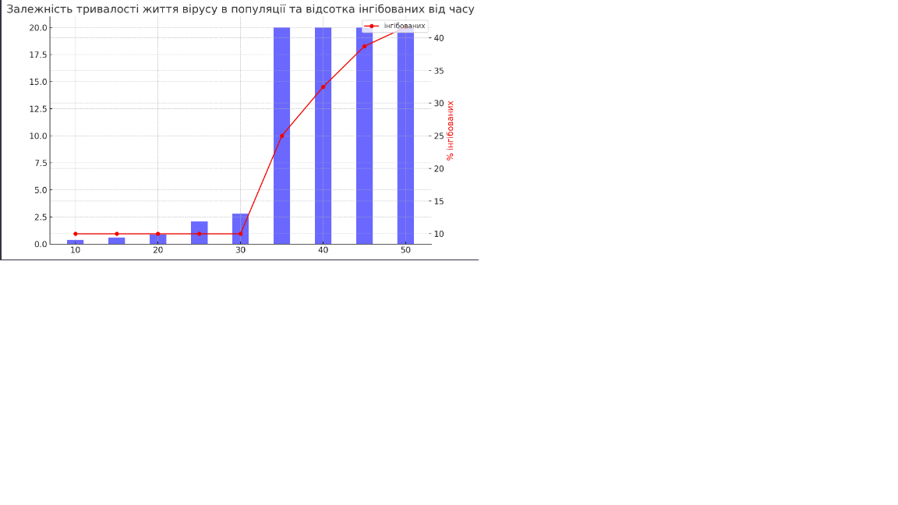
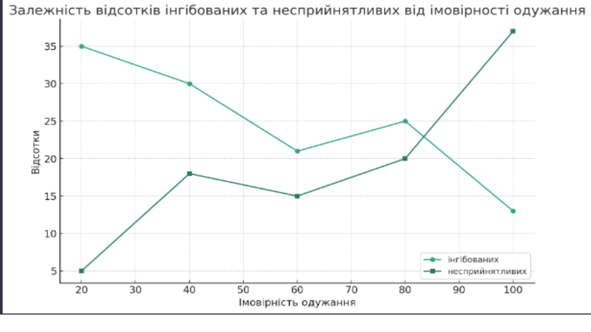

## Комп'ютерні системи імітаційного моделювання
## СПм-22-5, **Максименков Олексій**
### Лабораторна робота №**1**. Опис імітаційних моделей та проведення обчислювальних експериментів

 

### 3 Варіант, Модель поширення захворювання у людській популяції.:
[Virus](http://https://www.netlogoweb.org/launch#https://www.netlogoweb.org/assets/modelslib/Sample%20Models/Biology/Virus.nlogo)

 

### Вербальний опис моделі:
Ця модель показує, як вірус поширюється і продовжує існувати в певній групі людей (черепах). На початку є певна кількість людей, 10 з яких вже інфіковані. Люди випадково пересуваються в цьому симульованому середовищі в одному з трьох станів:
Здорові, але можуть підхопити вірус (показано зеленим кольором),
Хворі і здатні поширювати вірус (показані червоним кольором),
Здоровий і не може знову підхопити вірус (показано сірим кольором).

Люди в моделі можуть померти через вірус або природне старіння. Якщо кількість людей опускається нижче певної межі,"пропускна здатність" середовища (у цьому сценарії вона становить 300 осіб), здорові люди можуть народжувати здорове потомство.

### Керуючі параметри:
- **number-people**: визначає кількість людей у середовищі моделювання.
- **infectiousness**: визначає ймовірнінсть, що хвора людина заразить інших людей у тому самому місці, параметр, який визначає ймовірність передачі інфекції від зараженої людини до людини, яка може підхопити вірус, коли вони знаходяться в безпосередній близькості.
- **chance-recover**: визначає вірогідність видужати і набути імунітет після зараження.
- **duration**: визначає тривалість часу в тижнях, скільки хвора людина має залишатися інфікованою, перш ніж вона або одужає та отримає імунітет, або помре від інфекції.

### Внутрішні параметри:
- **lifespan**: визначає тривалість життя людей у моделі. lifespan = 2600 тижнів, що відповідає приблизно 50 рокам.
- **chance-reproduce**: визначає ймовірність того, що людина може створити нащадка кожного кроку симуляції, якщо популяція менше за carrying-capacity. Цей параметр встановлено в значення 1%.
- **immunity-duration**: визначає, протягом скількох тижнів залишається імунітет у людей після того, як вони відновилися від інфекції. Дорівнює 52 тижням - 1 рік.
- **sick?**: визначає, чи хвора людина.

### Показники роботи системи:
- який % населення є заразними.
- який % населення має імунітет.
- скільки пройшло років.
- кількість інфікованих людей
- кількість здорових людей
- кількість людей з імунітетом
- загальна кількість людей

### Недоліки моделі:
До недоліків можна віднести, що майже всі параметри у моделі є статичними і не змінюються з часом. На практиці ці параметри можуть змінюватися від динаміки хвороби та реакцій організму людини на неї. До цього відноситься і сама ймовірність захворіти і тривалість цієї хвороби. Ну і ці параметри можуть відризнятись у людей з різним віком, стартовим здоров'ям і т.і. 

 

## Обчислювальні експерименти
### 1. Вплив кількості людей в популяції на перебіг епідемії в ній
Досліджуємо залежність кількості інфікованих людей і людей з імунітетом через рік від початку епідемії (52 такти) від числа людей у популяції.
Експерименти проводяться при 50,100,150,200,250,300 людях, крок в 50, 6 симуляцій.
Інші керуючі параметри за замовчуванням:
- **infectiousness**: 65%
- **chance-recover**: 75%
- **duration**: 20

<table>
<thead>
<tr><th>Кількість людей</th><th>% інфікованих</th><th>% несприйнятливих</th></tr>
</thead>
<tbody>
<tr><td>50</td><td>0</td><td>18,7</td></tr>
<tr><td>100</td><td>11,2</td><td>16</td></tr>
<tr><td>150</td><td>30,2</td><td>32,6</td></tr>
<tr><td>200</td><td>37,1</td><td>26,9</td></tr>
<tr><td>250</td><td>38,6</td><td>41,4</td></tr>
<tr><td>300</td><td>45,4</td><td>36,1</td></tr>
</tbody>
</table>

За цими даними можна побачити, що при збільшенні кількості людей у популяції збільшується і кількість інфікованих.Проте, при максимальній для моделі кількості людей (300) % інфікованих стає меншим, бо частина популяції вже має імунітет.
Але якщо дивитись на показник людей з імунітетом, то залежність не є прямою. Вийшло, що при 200 людях % несприйнятливих менше, ніж при 150 або 250 людях. Я припускаю, що на ци якось впливають показники швидкості розповсюдження інфекції чи швидкість одужання.

### 2. Вплив тривалості часу, коли людина хвора, на виживання вірусу в популяції людей  
Досліджуємо виживання вірусу у популяції при певній тривалості часу у тижнях, протягом якого людина хвора. Максимум 2600 тактів (50 років).
Експерименти проводяться при 10-50 тижнях хвороби, з кроком 5, усього 9 симуляцій.  
Інші керуючі параметри за замовчуванням:
- **number-people**: 150
- **infectiousness**: 20%
- **chance-recover**: 75%

<table>
<thead>
<tr><th>Тижні</th><th>Тривалість життя вірусу в популяції (роки)</th><th>% інфікованих</th></tr>
</thead>
<tbody>
<tr><td>10</td><td>0,4</td><td>10</td></tr>
<tr><td>15</td><td>0,6</td><td>10</td></tr>
<tr><td>20</td><td>0,9</td><td>10</td></tr>
<tr><td>25</td><td>2,1</td><td>10</td></tr>
<tr><td>30</td><td>2,8</td><td>10</td></tr>
<tr><td>35</td><td>20</td><td>25</td></tr>
<tr><td>40</td><td>20</td><td>32,48</td></tr>
<tr><td>45</td><td>20</td><td>38,70</td></tr>
<tr><td>50</td><td>20</td><td>41,63</td></tr>
</tbody>
</table>

За результатами експерименту видно, що тривалість часу, протягом якого людина інфікована, має значущий вплив на виживання вірусу в популяції. Зі збільшенням тривалості хвороби збільшується і тривалість життя вірусу в популяції людей. Видно, що при 10 тижнях вірус дуже швидко вимирає, але при тривалості 35 тижнів і більше вірус має можливість вічно самовідтворюватись у популяції (і відсоток інфікованих так само збільшується).

### 3. Вплив ймовірності одужання на динаміку епідемії
Досліджуємо вплив ймовірності одужання на динаміку епідемії за 1 рік. Експерименти проводяться при 20-100 ймовірності одужання, з кроком 20, усього 5 симуляцій.  
Інші керуючі параметри за замовчуванням:
- **number-people**: 100
- **infectiousness**: 65%
- **duration**: 20

<table>
<thead>
<tr><th>Ймовірність одужання</th><th>% інфікованих</th><th>% несприйнятливих</th></tr>
</thead>
<tbody>
<tr>20<td>20</td><td>35</td><td>5</td></tr>
<tr><td>40</td><td>30</td><td>18</td></tr>
<tr><td>60</td><td>21</td><td>15</td></tr>
<tr><td>80</td><td>25</td><td>20</td></tr>
<tr><td>100</td><td>13</td><td>37</td></tr>
</tbody>
</table>

За результатами експерименту видно, що при збільшенні ймовірності одужання відсоток інфікованих спадає з 35% до 13%.Так само збільшується і відсоток несприйнятливих до вірусу, з 5% до 37%.

### Контрольні запитання
- **Що таке моделювання? У чому різниця між моделюванням та симуляцією?**

Моделювання - це процес створення абстрактних уявлень про системи, об'єкти чи явища для аналізу та розуміння їхньої поведінки чи характеристик. Воно передбачає спрощення реальності шляхом зосередження на ключових аспектах, ігноруючи менш важливі деталі.
З іншого боку, симуляція - це використання моделі для імітації функціонування реального процесу або системи в часі. Воно передбачає запуск моделі в заданих умовах для спостереження за її поведінкою, що допомагає робити прогнози або приймати рішення.
Ключова відмінність полягає в тому, що моделювання полягає у створенні репрезентації, тоді як симуляція - у використанні цієї репрезентації для дослідження поведінки або прогнозування результатів у динаміці. Моделювання створює основу для симуляції.

- **Які завдання моделювання?**

Визначення проблеми: Чітке визначення проблеми, яку має вирішити модель. Це передбачає розуміння системи, її компонентів та цілей моделювання.
Системний аналіз: Аналіз реальної системи, що підлягає моделюванню. Це передбачає визначення ключових змінних, процесів, взаємодій та поведінки, притаманних системі.
Збір даних: Збір відповідних даних, необхідних для моделі. Ці дані можуть включати кількісні вимірювання, якісні спостереження та експертні висновки.
Розробка концептуальної моделі: Створення спрощеного представлення системи. Це передбачає абстрагування та спрощення системи до форми, яку можна представити математично або обчислювально.
Формалізація моделі: Переведення концептуальної моделі в математичну або обчислювальну модель. Це передбачає вибір відповідних алгоритмів, рівнянь і структур даних.
Реалізація моделі: Кодування моделі у форму, придатну для комп'ютера, за допомогою мов програмування або програмного забезпечення для моделювання.
Верифікація та валідація: Забезпечення того, що модель точно відображає концептуальну модель (верифікація) і що вона точно відображає реальну систему (валідація).
Експерименти та аналіз: Проведення симуляцій з використанням моделі, експериментування з різними сценаріями та аналіз результатів.
Експерименти та аналіз: Запуск симуляцій з використанням моделі, експерименти з різними сценаріями та аналіз результатів.
Інтерпретація результатів: Інтерпретація результатів симуляції в контексті вихідної проблеми. Сюди входить розуміння наслідків результатів і будь-яких обмежень.
Документація та звітність: Документування процесу моделювання, припущень і результатів, а також звітування про результати зацікавленим сторонам або в наукових публікаціях.
Обслуговування та оновлення моделі: Обслуговування та оновлення моделі, коли з'являються нові дані або змінюється система, яку вона представляє.

- **У чому різниця між об'єктом та системою?**

Об'єкт:
Визначення: Об'єкт - це окрема сутність з чітко визначеними характеристиками та поведінкою. З точки зору обчислень, це часто означає екземпляр класу в об'єктно-орієнтованому програмуванні.
Характеристики: Об'єкти мають атрибути (властивості або стан) і методи (функції або поведінка). Вони інкапсулюють дані та операції, які можуть бути виконані над цими даними.
Сфера застосування: Об'єкт зазвичай є компонентом або частиною більшої системи. Він представляє єдину сутність або концепцію в моделі.
Приклад: У симуляції дорожнього руху об'єктом може бути один автомобіль з такими атрибутами, як швидкість і колір, і такими методами, як прискорення і зупинка.

Система:
Визначення: Система - це складне ціле, що складається з взаємопов'язаних і взаємозалежних елементів (об'єктів, компонентів або підсистем). Вона характеризується взаємодією та відносинами між її частинами.
Характеристики: Системи мають структуру (як пов'язані між собою компоненти), поведінку (як компоненти взаємодіють і функціонують разом) і призначення (загальна мета або функція системи).
Масштаб: Система ширша за обсягом і охоплює кілька об'єктів або компонентів. Вона представляє весь набір елементів, що працюють разом для досягнення спільної мети.
Приклад: Продовжуючи приклад з симуляцією дорожнього руху, системою буде вся транспортна мережа, що охоплює безліч об'єктів, таких як автомобілі, світлофори, дороги і т.д., а також їх взаємодію.

Таким чином, об'єкт - це окрема, дискретна одиниця з власними властивостями та поведінкою, тоді як система - це сукупність об'єктів або компонентів, які взаємодіють і функціонують разом як єдине ціле. Зосередженість на окремих елементах та їхніх характеристиках відрізняє об'єкти від систем, які визначаються їхньою складною природою та взаємодією всередині.
- **У чому полягає негативний зворотний зв'язок?**

процес, коли система саморегулюється, зменшуючи відхилення або зміни від свого бажаного стану або заданого значення. Ця концепція є ключовою у підтримці стабільності та рівноваги в різних типах систем, включаючи біологічні, екологічні, механічні та соціальні системи. Ось коротке пояснення:
Механізм: При негативному зворотному зв'язку зміна в системі спричиняє ефекти, які діють всупереч цій зміні. Це має тенденцію зменшувати або протидіяти початковому відхиленню, повертаючи систему до рівноваги або бажаного стану.
Мета: Основна мета негативного зворотного зв'язку - підтримувати стабільність і контроль у системі. Він допомагає системі протистояти зовнішнім збуренням і підтримувати стабільний стан.
Приклад: Поширеним прикладом є гомеостаз у біологічних системах, наприклад, регуляція температури тіла у людини. Якщо температура тіла підвищується, запускаються такі механізми, як потовиділення, щоб охолодити тіло, повертаючи температуру до нормального діапазону.
Контраст з позитивним зворотним зв'язком: На відміну від позитивного зворотного зв'язку, який посилює зміни і може призвести до непередбачуваних процесів, негативний зворотний зв'язок гасить їх, сприяючи стабільності.
Застосування в моделюванні: У комп'ютерній симуляції та системному моделюванні негативний зворотний зв'язок часто використовується для точного відображення того, як реальні системи саморегулюються і підтримують рівновагу за різних умов.

- **Що означає адекватність моделі?**

Адекватність моделі - це ступінь, до якого імітаційна або обчислювальна модель точно відображає реальну систему, яку вона має імітувати. Це міра того, наскільки добре модель відповідає своєму призначенню, враховуючи її обсяг, цілі та конкретний контекст, в якому вона використовується. Ключові аспекти адекватності моделі включають
Точність: Результати моделі повинні точно відповідати фактичним даним або поведінці реальної системи за подібних умов.
Валідність: Модель повинна бути валідною, тобто правильно відображати основні характеристики і динаміку системи, яку вона представляє. Це включає як структурну валідність (структура моделі відображає структуру системи), так і поведінкову валідність (поведінка моделі імітує поведінку системи).
Надійність: Модель повинна давати узгоджені результати за однакових умов, демонструючи надійність своєї роботи.
Застосовність: Модель повинна бути застосовна до діапазону сценаріїв або умов, для яких вона була розроблена. Вона повинна надавати корисні та релевантні уявлення або прогнози про систему.
Повнота: Модель повинна включати всі необхідні компоненти і взаємодії для точного представлення системи, але без зайвої складності, яка не додає цінності симуляції.
Чутливість: Модель повинна адекватно реагувати на зміни вхідних параметрів, показуючи реалістичну чутливість до факторів, які суттєво впливають на реальну систему.
Прозорість і зрозумілість: Модель повинна бути прозорою і зрозумілою для користувачів, що дозволить їм зрозуміти, як працює модель і як вона робить свої висновки.
Верифікація та валідація: Модель повинна бути ретельно верифікована (правильно реалізована) і валідизована (точно відображати реальну систему) шляхом суворого тестування і порівняння з реальними даними.
- **Види моделей.**

Фізичні моделі: Це матеріальні або фізичні представлення реальних систем. Прикладами є масштабні моделі будівель, літаків або навіть органів людського тіла.
Математичні моделі: Ці моделі використовують математичні вирази для представлення взаємозв'язків між різними елементами системи. Вони можуть варіюватися від простих рівнянь до складних математичних структур.
Статистичні моделі: Ці моделі використовуються для аналізу даних і прогнозування на основі статистичних принципів. До них належать регресійні моделі, моделі часових рядів та імовірнісні моделі.
Детерміновані моделі: У детермінованих моделях заданий набір початкових умов завжди призводить до однакових результатів. Вони не враховують випадковість або невизначеність у системі.
Стохастичні (імовірнісні) моделі: Ці моделі включають випадковість і невизначеність. Вони використовуються, коли системам притаманна мінливість, і вони забезпечують діапазон можливих результатів, а не один конкретний результат.
Динамічні моделі: Динамічні моделі представляють системи, які змінюються з часом. Вони використовуються для вивчення того, як змінюються і взаємодіють змінні системи протягом певного періоду.
Статичні моделі: На відміну від динамічних моделей, статичні моделі не змінюються з часом. Вони представляють систему в певний момент часу.
Дискретні моделі: Ці моделі представляють системи, в яких зміни відбуваються в певні моменти часу. Вони часто використовуються в симуляціях, де змінні змінюються з певними кроками або інтервалами.
Безперервні моделі: У безперервних моделях зміни відбуваються протягом безперервного діапазону часу або простору. Ці моделі використовуються в ситуаціях, коли стан системи постійно змінюється.
Агентні моделі: Ці моделі імітують дії та взаємодію автономних агентів (окремих осіб або колективних утворень, таких як організації) для оцінки їхнього впливу на систему в цілому.
Моделі системної динаміки: Ці моделі зосереджуються на петлях зворотного зв'язку та часових затримках, що впливають на поведінку всієї системи, і часто використовуються для розуміння складної, нелінійної поведінки у великих системах.
Гібридні моделі: Гібридні моделі поєднують в собі риси двох або більше вищезгаданих типів для більш ефективного відображення складності системи.

- **Як описується аналітична модель?**

Аналітична модель - це тип моделі, яка використовує математичні формулювання для опису поведінки системи. Ключові характеристики та опис аналітичної моделі включають
Математична основа: Аналітична модель ґрунтується на математичних рівняннях і виразах. Ці рівняння використовуються для представлення взаємозв'язків і взаємодій між різними змінними в системі.
Детермінований характер: Часто аналітичні моделі є детермінованими, тобто вони забезпечують конкретний результат для певного набору вхідних даних без включення випадковості або імовірнісних елементів. Однак деякі аналітичні моделі можуть включати стохастичні елементи.
Теоретична основа: Ці моделі, як правило, ґрунтуються на теоретичних принципах, таких як фізичні закони, економічні теорії або статистичні припущення.
Спрощення та абстрагування: Аналітичне моделювання передбачає спрощення реальної системи до абстрактної форми, яку можна математично описати. Цей процес вимагає визначення ключових змінних та їх взаємозв'язків, опускаючи менш важливі деталі.
Методи розв'язання: Аналітичні моделі часто вирішуються за допомогою математичних методів, таких як обчислення, лінійна алгебра або методи оптимізації. Рішення можуть бути точними або наближеними, залежно від складності моделі.

Математичні моделі та аналітичні моделі є тісно пов'язаними поняттями у сфері імітаційного моделювання та системного аналізу, і ці терміни часто використовуються як взаємозамінні. Однак між ними можуть бути нюанси, що відрізняють їх:

Математичні моделі:
Широка сфера застосування: Математичні моделі охоплюють широкий спектр методів моделювання, які використовують математичну мову для опису поведінки систем. Ця категорія включає як аналітичні, так і чисельні методи.
Гнучкість рішень: Математичні моделі можна розв'язувати різними методами, не обмежуючись аналітичними (точними) рішеннями. До них можна підійти за допомогою чисельних методів, симуляцій або навіть обчислювальних алгоритмів, коли аналітичні рішення не є можливими.
Різноманітність застосувань: Використовуються в різних галузях, таких як фізика, біологія, економіка, соціальні науки та інженерія, і можуть бути як детермінованими, так і стохастичними.

Аналітичні моделі:
Підгрупа математичних моделей: Аналітичні моделі - це особливий тип математичних моделей. Вони характеризуються тим, що їх можна розв'язати за допомогою аналітичних методів, тобто можна отримати точні, закриті вирази для розв'язків.
Зосередьтеся на точних розв'язках: Аналітичні моделі наголошують на виведенні чітких формул або виразів для опису поведінки систем. Ці рішення зазвичай отримують за допомогою таких методів, як алгебра, обчислення або інших математичних методів.
Обмеження складності: Через свою залежність від отримання точних рішень аналітичні моделі часто менш придатні для надзвичайно складних систем, де такі рішення є недоцільними або неможливими. У таких випадках можна використовувати чисельні або імітаційні підходи (все ще в рамках математичних моделей).

Таким чином, хоча всі аналітичні моделі є математичними моделями, не всі математичні моделі є аналітичними. Математичні моделі є ширшою категорією, що включає будь-яку модель, яка використовує математичну мову і методи, і може бути вирішена за допомогою різних методів, включаючи, але не обмежуючись аналітичними рішеннями. Аналітичні моделі - це ті математичні моделі, які можна розв'язати за допомогою точних виразів у замкненому вигляді.

- **Що таке "стан" моделі?**

"Стан" моделі в контексті комп'ютерного моделювання та системного аналізу означає всебічний опис певного стану або ситуації системи в конкретний момент часу. Він охоплює всі відповідні змінні та параметри, які визначають поточний стан системи. Нижче наведено ключові аспекти модельного стану:
Набір змінних: Стан моделі характеризується набором змінних, які представляють різні аспекти системи. Ці змінні можуть включати фізичні величини, такі як температура або швидкість у фізичній системі, або абстрактні величини, такі як кількість виконаних завдань у моделі робочого процесу.
Знімок у часі: стан представляє собою знімок системи в певний момент часу. У динамічних моделях стан змінюється з часом, тому стан моделі може бути різним на кожному часовому кроці.
Детермінанта майбутньої поведінки: Поточний стан моделі зазвичай впливає на її майбутню поведінку. У динамічних системах наступний стан моделі визначається поточним станом і правилами або рівняннями, що регулюють еволюцію системи.
Початкові та граничні умови: У багатьох моделях, особливо в імітаційних, визначення початкового стану (стану на початку спостережуваного періоду) і граничних умов (обмежень або умов на кордонах системи) має вирішальне значення для аналізу поведінки системи в часі.
Представлення в різних типах моделей:
У дискретних моделях стан часто представлений окремими і чітко визначеними умовами.
У безперервних моделях стан може бути представлений набором безперервних змінних.
У стохастичних моделях стан може включати ймовірності або розподіли для представлення невизначеності.
Важливість у моделюванні: Розуміння і точне визначення стану є критично важливим в імітаційному моделюванні, оскільки це дозволяє відтворити, проаналізувати і передбачити поведінку системи за різних сценаріїв.

По суті, стан моделі - це формальне представлення стану системи в певний момент часу, що містить всю необхідну інформацію для опису системи та прогнозування її майбутньої поведінки.

- **Особливості імітаційних моделей.**

Імітаційні моделі, що використовуються для відтворення поведінки реальних систем або процесів, мають кілька відмінних рис, які відрізняють їх від інших типів моделей. Ці особливості дозволяють імітаційним моделям ефективно аналізувати складні системи, тестувати сценарії та прогнозувати результати. Ось ключові особливості імітаційних моделей:
Відображення часу: Імітаційні моделі часто явно відображають час, що дозволяє їм імітувати динамічну поведінку систем у процесі їхнього розвитку. Вони можуть бути як дискретними (час протікає поетапно), так і безперервними.
Включення випадковості: Багато імітаційних моделей включають стохастичні елементи для відображення випадковості або невизначеності, притаманних реальним системам. Ця функція особливо важлива в моделях, де мінливість суттєво впливає на поведінку системи.
Гнучкість у проектуванні: Імітаційні моделі є дуже гнучкими, здатними представляти широкий спектр систем - від простих процесів до дуже складних і взаємопов'язаних систем. Ця гнучкість дозволяє адаптувати їх до конкретних потреб і сценаріїв.
Можливість тестування сценаріїв: Однією з головних переваг імітаційних моделей є їх здатність тестувати різні сценарії "що, якщо". Користувачі можуть змінювати параметри або умови в моделі, щоб спостерігати за потенційними результатами, що є безцінним для планування, прийняття рішень та оцінки ризиків.
Представлення складних систем: Імітаційні моделі можуть представляти складні системи, які важко або неможливо змоделювати аналітично. Вони можуть відображати нелінійні взаємодії, петлі зворотного зв'язку та емерджентну поведінку всередині систем.
Візуалізація та анімація: Багато імітаційних моделей забезпечують візуальне або анімоване представлення системи, що допомагає зрозуміти, інтерпретувати і передавати поведінку і результати моделі.
Валідація та верифікація: Імітаційні моделі, як правило, проходять сувору валідацію (гарантуючи, що модель точно представляє реальну систему) і верифікацію (гарантуючи, що модель реалізована правильно).
Інтерактивність: Деякі імітаційні моделі є інтерактивними, що дозволяє користувачам змінювати параметри в режимі реального часу і негайно бачити вплив цих змін на систему.
Ресурсоємність: Залежно від складності, імітаційні моделі можуть бути ресурсоємними, вимагаючи значних обчислювальних потужностей для запуску симуляцій, особливо для великомасштабних або високодеталізованих моделей.

- **Що таке концептуальна модель?**

Концептуальна модель у контексті системного аналізу та комп'ютерного моделювання - це високорівневе представлення системи, що ілюструє її ключові компоненти та їхню взаємодію. Вона слугує абстрактною основою для розуміння та пояснення того, як працює система. Основні аспекти концептуальної моделі включають
Абстрагування від реальності: Концептуальна модель - це абстрактне представлення, яке спрощує реальну систему, виділяючи її найважливіші елементи та взаємозв'язки, не занурюючись у деталі.
Ідентифікація ключових компонентів: Визначає критичні компоненти або елементи системи, такі як змінні, сутності, процеси та їхні атрибути.
Ілюстрація взаємозв'язків і взаємодій: Модель показує, як компоненти системи взаємодіють і співвідносяться один з одним, часто виділяючи причинно-наслідкові зв'язки, петлі зворотного зв'язку і залежності.
Фундамент для більш детальних моделей: Концептуальні моделі слугують основою для розробки більш детальних і конкретних моделей, таких як математичні або обчислювальні моделі. Вони допомагають прояснити структуру і функціонування системи перед тим, як заглибитися в технічне моделювання.
Інструмент для комунікації та розуміння: Концептуальні моделі є цінним інструментом для передачі ідей і розуміння складних систем. Вони часто використовуються для того, щоб забезпечити спільне розуміння зацікавленими сторонами досліджуваної системи.
Універсальність форми: Вони можуть мати різні форми, від простих діаграм і блок-схем до детальних описів або графічних зображень, залежно від складності системи та аудиторії.
Зосередьтеся на концепціях високого рівня: Концептуальні моделі надають пріоритет концепціям високого рівня та загальній динаміці системи, а не конкретним даним чи детальним механізмам.
Використання в різних сферах: Вони використовуються в різних дисциплінах, таких як інформаційні системи, програмна інженерія, екологія, економіка та соціальні науки.

Підсумовуючи, концептуальна модель - це високорівневе абстрактне представлення системи, яке допомагає зрозуміти її фундаментальні аспекти та динаміку. Вона слугує основним інструментом для комунікації, аналізу та подальшого розвитку моделі.

- **Які етапи моделювання?**

Цей процес гарантує, що модель точно представляє досліджувану систему і служить своєму призначенню. Основними етапами є

Визначення проблеми:
Чітко визначте проблему або питання, на яке має відповісти модель.
Визначте мету і завдання проекту моделювання.

Системний аналіз та концептуалізація:
Зрозуміти та проаналізувати реальну систему.
Визначте ключові компоненти, взаємозв'язки, процеси, входи і виходи.
Розробити концептуальну модель, яка абстрактно представляє систему.

Збір даних:
Зберіть відповідні дані, необхідні для побудови моделі.
Це можуть бути емпіричні дані, експертні висновки, літературні дослідження та інша відповідна інформація.

Формулювання моделі:
Перетворення концептуальної моделі на більш формалізовану модель.
Це може включати створення математичних рівнянь, логічних потоків або алгоритмів.

Реалізація моделі:
Перетворення формальної моделі на обчислювальну або симуляційну модель.
Це передбачає кодування моделі за допомогою відповідних програмних інструментів або мов програмування.

Верифікація:
Переконатися, що модель була правильно реалізована.
Це передбачає перевірку на наявність помилок у програмуванні та забезпечення відповідності моделі концептуальній та формалізованій версіям.

Валідація:
Підтвердження того, що модель точно відображає реальну систему.
Порівняйте результати моделі з реальними даними або експертними оцінками, щоб забезпечити реалістичність і точність.

Аналіз моделі та експерименти:
Проведіть експерименти з використанням моделі.
Проаналізуйте поведінку моделі за різних сценаріїв та значень параметрів.

Інтерпретація та документація:
Інтерпретація результатів в контексті вихідної проблеми.
Задокументуйте модель, її основні припущення, обмеження та результати експериментів.

Обслуговування та оновлення моделі:
Регулярно оновлюйте і підтримуйте модель, щоб забезпечити її постійну актуальність і точність.
Включайте нові дані, зворотній зв'язок та зміни в систему за потреби.

- **У чому різниця між індуктивним та дедуктивним підходами моделювання систем?**

Індуктивний підхід:
Висхідні міркування: Індуктивне моделювання починається з конкретних спостережень або даних, а потім узагальнює ці спостереження для розробки ширших узагальнень або теорій.
Орієнтоване на дані: Воно значною мірою покладається на дані, зібрані з реального світу. Моделювальник спостерігає за шаблонами, закономірностями і тенденціями в даних і використовує їх для побудови моделі.
Емпіричний фокус: Основна увага приділяється емпіричним даним. Модель будується на основі того, що показують дані про систему.
Розробка моделі: Моделі, розроблені індуктивно, можуть починатися без попередньої теорії. Теорія або загальні принципи випливають з аналізу даних.
Приклад використання: Індуктивні підходи часто застосовують у пошукових дослідженнях, метою яких є виявлення закономірностей або взаємозв'язків, які ще недостатньо вивчені.

Дедуктивний підхід:
Міркування зверху вниз: Дедуктивне моделювання починається із загальної теорії або гіпотези, а потім рухається до більш конкретних висновків або прогнозів.
Теоретико-орієнтоване: Починається з усталених теорій або принципів, які потім використовуються для розробки моделі. Конкретні гіпотези виводяться з цих теорій.
Логічна структура: Підхід більше зосереджений на логічних міркуваннях від загального до конкретного. Якщо початкова теорія вважається істинною, то висновки, що випливають з неї, також повинні бути істинними.
Перевірка моделі: Модель використовується для перевірки гіпотез. Якщо передбачення моделі збігаються з реальними спостереженнями, теорія підтримується; якщо ні, можливо, її потрібно переглянути.
Приклад використання: Дедуктивні підходи зазвичай використовуються, коли є існуюча теоретична база, яку можна застосувати до нової проблеми або системи.

Таким чином, індуктивний підхід у системному моделюванні ґрунтується на даних і будується від конкретних спостережень до загальних теорій, тоді як дедуктивний підхід ґрунтується на теорії, починаючи із загальних теорій або гіпотез і переходячи до конкретних прогнозів або моделей. Вибір між цими підходами залежить від природи системи, що моделюється, цілей проекту моделювання, а також від наявності даних і усталених теорій.

- **Що таке модельний час?**

Це часовий проміжок, в якому імітуються процеси та зміни в моделі.

"Час моделювання" в контексті системної симуляції та моделювання відноситься до представлення часу в моделі. Це важливий аспект у симуляціях, оскільки він визначає, як модель обробляє розвиток і послідовність подій або станів. Існує два основних типи часу моделювання:

Дискретний час:
Події з дискретними інтервалами: У моделях з дискретним часом зміни стану системи відбуваються в певні, відокремлені один від одного моменти часу.
Покрокова прогресія: Час просувається вперед окремими кроками або приростами. Кожен крок представляє момент, коли стан моделі може змінитися.
Варіанти використання: Поширений у сценаріях, де зміни відбуваються в чіткі, окремі моменти часу, наприклад, коли клієнти приходять до служби підтримки або здійснюють транзакції в банківській системі.

Безперервний час:
Безперервні зміни: У моделях безперервного часу зміни в системі можуть відбуватися будь-якої миті.
Плавна прогресія: Час розглядається як безперервний континуум, що дозволяє моделі фіксувати зміни, які відбуваються плавно і безперервно з плином часу.
Варіанти використання: Часто використовується в моделюванні фізичних систем, таких як моделі зміни клімату або орбітальна механіка, де зміни відбуваються безперервно.

Вибір між дискретним і неперервним часом залежить від природи системи, що моделюється, та рівня деталізації. Деякі моделі можуть навіть використовувати гібридний підхід, що включає як дискретні, так і безперервні елементи, для більш точного представлення складних систем.