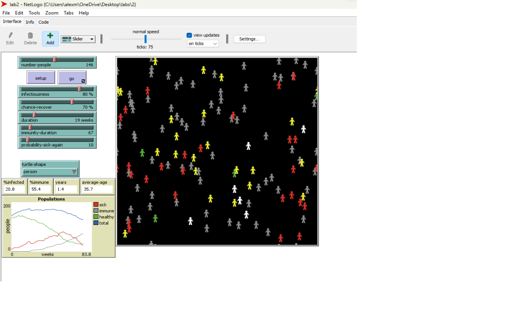
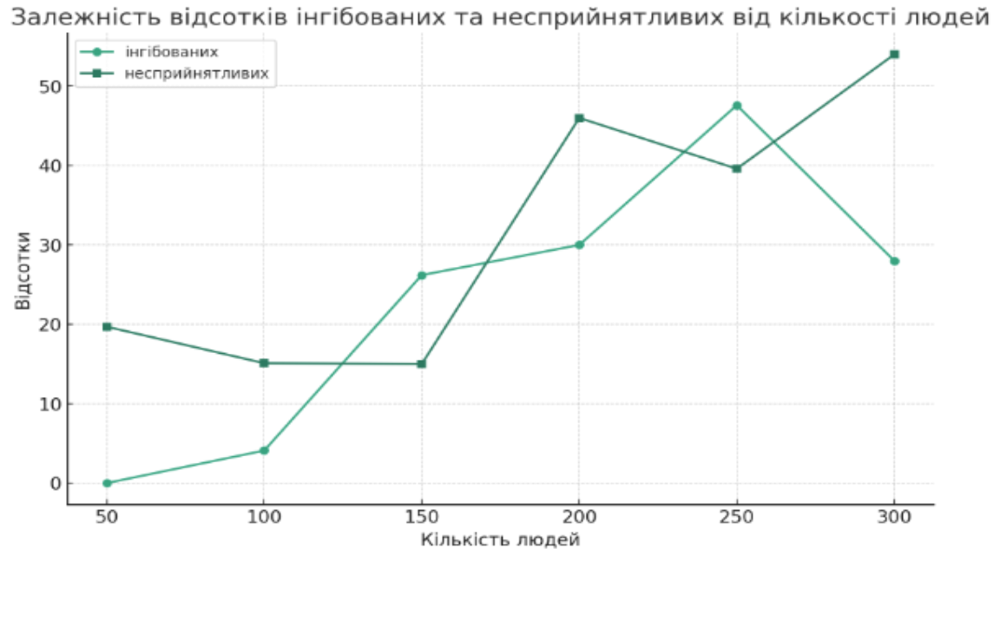

## Комп'ютерні системи імітаційного моделювання
## СПм-22-5, **Максименков Олексій**
### Лабораторна робота №**2**. Редагування імітаційних моделей у середовищі NetLogo

 

### 3 Варіант, модель у середовищі NetLogo:
[Virus](https://www.netlogoweb.org/launch#https://www.netlogoweb.org/assets/modelslib/Sample%20Models/Biology/Virus.nlogo)

 

### Внесені зміни у вихідну логіку моделі, за варіантом:

**Додати вплив віку на інфікування та результат захворювання.** 

 Infection-probability - ймовірність зараження
 recover-probability - ймовірність одужання для кожної особи в залежності від її віку. Ці функції враховують вік особи, щоб симулювати той факт, що імунітет та вразливість до хвороби можуть змінюватися з віком. 3 вікові категорії (діти, дорослі, старші люди).

<pre>
to-report infection-probability 
  ;; Define an age-dependent probability of infection
  ;; You can modify this formula to suit your needs
  if age < 52 * 20
  [report (infectiousness + 20 - (age / 52))] ;;для дітей (до 20 років), частіше зворіють, але набувають сильніший імунітет
  if age >= 52 * 20 and age <= 52 * 50
  [report infectiousness]  ;;у дорослих (20-50 років) звичайний шанс заболіти
  if age > 52 * 50
  [report infectiousness + (age / 52) - 50] ;;Після 50 років на 1% легше хворіють за рік (легше = більше вірогідність мається на увазі)
end
to-report recover-probability 
  ;; Define an age-dependent probability of infection
  ;; You can modify this formula to suit your needs
  if age < 52 * 20
  [report (chance-recover - 20 + (age / 52))] ;;
  if age >= 52 * 20 and age <= 52 * 50
  [report chance-recover]  ;;
  if age > 52 * 50
  [report chance-recover - ((age / 52) - 50)] ;;
end
  </pre>

<pre>
;; If a turtle is sick, it infects other turtles on the same patch.
;; Immune turtles don't get sick.
to infect ;; turtle procedure
  ask other turtles-here with [ not sick? and not immune? ]
    [ let age-influence infection-probability
      if random-float 100 < age-influence
      [ get-sick ] ]
end
                            
;; Once the turtle has been sick long enough, it
;; either recovers (and becomes immune) or it dies.
to recover-or-die ;; turtle procedure
  if sick-time > duration                        ;; If the turtle has survived past the virus' duration, then
    [ ifelse random-float 100 < recover-probability    ;; either recover or die
      [ become-immune ]
      [ die ] ]
end
</pre>

                                
**Додати вплив ступеня поширення захворювання (поточного відсотка інфікованих) на вірогідність появи нових хворих.**
 Змінена процедура update-global-variables: додано встановлення chance-reproduce в залежності від кількості інфікованих.
Чим більше інфікованих, тим менше шанс на вірогідність появи нових агентів. До цього по дефолту була 1%.
<pre>
to update-global-variables
  if count turtles > 0
    [ set %infected (count turtles with [ sick? ] / count turtles) * 100
      set %immune (count turtles with [ immune? ] / count turtles) * 100 
      set chance-reproduce 1 - %infected / 100 ;; встановлення chance-reproduce в залежності від кількості інфікованих 
  ]
end
</pre>

**Додати можливість регулювання тривалості імунітету та вірогідності захворіти повторно.** 
люди з імунітетом могли повторно можуть заболіти з деяким шансом в залежності від початкових параметрів.
<pre>
    to infect ;; turtle procedure
  ask other turtles-here with [ not sick? ]
    [
      ifelse immune?
      [if random-float 100 < probability-sick-again ;;probability of getting sick again
        [ get-sick ]]
      [if random-float 100 < infection-probability
          [ get-sick ]]
  ]
end
</pre>

<pre>
 immunity-duration
</pre>

### Внесені зміни у вихідну логіку моделі, на власний розсуд:
<pre>
 set lifespan 100 * 52
</pre>

<pre>
 to update-display
  ask turtles
    [ if shape != turtle-shape [ set shape turtle-shape ]
      set color ifelse-value sick? [ red ] [ ifelse-value immune? [ grey ] [ set-color ] ] ]
end

to-report set-color
  if age < 20 * 52
  [report yellow]
  if age >= 20 * 52 and age < 50 * 52
  [report green]
  if age >= 50 * 52
  [report white]
  
end
</pre>

<pre>
 set average-age mean [age] of turtles / 52
</pre>

<pre>
 to reproduce
  if count turtles < carrying-capacity and random-float 100 < chance-reproduce and average-age > 10
    [ hatch 1
      [ set age 1
        lt 45 fd 1
        get-healthy ] ]
end
</pre>

<pre>
 ;; Turtles move about at random.
to move ;; turtle procedure
  let nearby-turtles other turtles in-radius 5 ; визначити туртлів у радіусі 5 одиниць
    if any? nearby-turtles with [sick?] [
      ; Якщо є інфіковані туртли поблизу, спробувати уникнути контакту
      rt random 40 - 20
      lt random 40 - 20
    ]
  let speed 0
  ifelse not sick? [set speed 1] [set speed 0.5];; швидкість руху
    ifelse random-float 100 < 70 ;; ймовірність змінити напрямок
    [
      rt random 40 - 20 ;; випадковий поворот на +/- 20 градусів
      lt random 40 - 20
    ]
    [
      ; продовжити рух у поточному напрямку
    ]
    fd speed ; рух на визначену відстань
end
</pre>

код моделі [link](lab2.nlogo). 
 

## Обчислювальні експерименти
### 1. Вплив кількості людей в популяції, а отже і щільності населення, на перебіг епідемії в популяції
Досліджується залежність кількості інфікованих людей і людей з імунітетом через 20 років від початку епідемії (1040 тактів) від числа людей у популяції.
Експерименти проводяться при 50-300 людей, крок 50, усього 6 симуляцій.  
Інші керуючі параметри мають значення за замовчуванням:
- **infectiousness**: 65%
- **chance-recover**: 75%
- **duration**: 20
- **imunity-duration**:52
- **probability-sick-again**:10

<table>
<thead>
<tr><th>Кількість людей</th><th>% інфікованих</th><th>% несприйнятливих</th></tr>
</thead>
<tbody>
<tr><td>50</td><td>0</td><td>19,7</td></tr>
<tr><td>100</td><td>4,1</td><td>15,1</td></tr>
<tr><td>150</td><td>26,2</td><td>15</td></tr>
<tr><td>200</td><td>30</td><td>46</td></tr>
<tr><td>250</td><td>47,6</td><td>39,6</td></tr>
<tr><td>300</td><td>28</td><td>54</td></tr>
</tbody>
</table>

За цими даними можна побачити, що при збільшенні кількості людей у популяції збільшується і кількість інфікованих.Проте, при максимальній для моделі кількості людей (300) % інфікованих стає меншим, бо частина популяції вже має імунітет.
Але якщо дивитись на показник людей з імунітетом, то залежність не є прямою. Вийшло, що при 200 людях % несприйнятливих менше, ніж при 150 або 250 людях. Я припускаю, що на ци якось впливають показники швидкості розповсюдження інфекції чи швидкість одужання.
Ну і після змін в коді видно, що % інфікованих і і людей з імунітетом тепер виглядає якось рандомно при зміні кількості людей. Можливо, це хочаб трохи схоже на епідемії в реальному житті і їх непередбачуваність. 

### Контрольні запитання
- **Які підходи у рамках імітаційного моделювання вам відомі?**

Моделювання дискретних подій (DES):
Зосереджується на моделюванні систем як послідовності дискретних подій, кожна з яких відбувається в певний момент часу.
Зазвичай використовується в дослідженнях операцій, логістиці, виробництві та моделюванні сфери послуг.

Системна динаміка (SD):
Наголошує на моделюванні складних систем, що характеризуються петлями зворотного зв'язку та часовими затримками.
Часто використовується для стратегічних, управлінських та соціально-економічних систем, включаючи моделювання навколишнього середовища та державної політики.

Агентно-орієнтоване моделювання (ABM):
Передбачає імітацію дій і взаємодій автономних агентів (осіб, організацій тощо) для оцінки їх впливу на систему.
Підходить для соціальних, економічних, біологічних та екологічних систем, особливо для вивчення емерджентних явищ.

Моделювання за методом Монте-Карло:
Використовує повторну випадкову вибірку для моделювання явищ зі значною невизначеністю.
Застосовується у фінансах, інженерії, аналізі ризиків та фізиці.

Безперервне моделювання:
Моделює системи, в яких зміни відбуваються безперервно в часі.
Використовується в інженерії, екології та фізиці, особливо для систем, що описуються диференціальними рівняннями.

Гібридне моделювання:
Поєднує елементи різних підходів до моделювання, таких як дискретна подія та безперервне моделювання або агентне моделювання та системна динаміка.
Корисно для складних систем, де потрібно одночасно представити кілька аспектів або моделей поведінки.

Мультиметодне моделювання:
Передбачає інтеграцію декількох методологій моделювання в рамках однієї моделі або дослідження.
Дозволяє провести більш комплексний аналіз, використовуючи сильні сторони різних підходів.

Аналіз скінченних елементів (FEA):
Чисельний метод прогнозування реакції виробу на реальні сили, вібрацію, тепло, потік рідини та інші фізичні впливи.
Широко використовується в дизайні та інженерії для структурного аналізу.

Обчислювальна гідродинаміка (CFD):
Зосереджується на моделюванні потоку рідини та її взаємодії з твердими структурами за допомогою чисельних методів.
Поширена в інженерії, метеорології та океанографії.

- **Види агентів у середовищі NetLogo. // далі всі питання - у контексті синтаксису середовища мультиагентного моделювання NetLogo.**

Основні типи агентів в NetLogo включають в себе наступні:

Черепахи:
Це основні агенти, що використовуються в моделях NetLogo.
Вони можуть представляти різні сутності в залежності від контексту моделі (наприклад, тварини, люди, автомобілі).
Черепашки можуть пересуватися по світу, взаємодіяти з іншими черепашками і патчами, а також змінювати свої властивості (наприклад, колір, розмір, напрямок руху).

Патчі:
Світ у NetLogo складається з сітки патчів.
Кожна ділянка - це квадратний шматок "землі", по якому рухаються черепашки.
Патчі мають свій власний набір властивостей (наприклад, колір, напис) і можуть взаємодіяти з черепашками або іншими патчами.

Зв'язки:
Зв'язки - це агенти, які з'єднують черепашок, утворюючи мережеву або графову структуру.
Вони корисні для моделювання відносин або зв'язків між черепашками, таких як соціальні мережі або маршрути руху.

Спостерігачі:
Спостерігач не є агентом, який існує у світі, як черепахи та патчі. Натомість, це перспектива, з якої світ контролюється і спостерігається.
Спостерігач віддає команди черепашкам і патчам і збирає від них дані.

З точки зору синтаксису і команд в NetLogo, кожен тип агента має набір команд і властивостей, характерних саме для нього. Наприклад:
Черепашки можуть бути створені за допомогою create-turtles і можуть виконувати такі команди, як переміщення, поворот, встановлення кольору тощо.
До патчів можна отримати доступ і змінити їхні властивості за допомогою команд на кшталт ask patches [set pcolor red] для зміни властивостей.
Посилання можна створювати за допомогою команд create-link-with або create-links-to, і вони можуть мати такі властивості, як товщина або колір.
Спостерігач використовує команди для налаштування середовища, ініціалізації агентів, запуску симуляції та збору даних.

- **Як створити процедуру та функцію?**

Процедури - це блоки коду, які виконують певні завдання, тоді як функції (також відомі як процедури-звіти в NetLogo) схожі на процедури, але повертають значення. Ось як їх визначити:

Створення процедури:
Процедура в NetLogo визначається за допомогою ключового слова to, за яким слідує ім'я процедури та блок коду, що закінчується ключовим словом end.

Створення функції (процедура-звіт):
Функції в NetLogo визначаються за допомогою ключового слова to-report, за яким слідує ім'я функції, блок коду і ключове слово end.

- **Як вивести повідомлення користувачеві?**
user-message
- **Як встановити значення змінної?**
`set variable-name value`
- **Як реалізуються цикли?**
repeat n [команд] для фіксованих ітерацій.
while [умова] [команди] для умовного циклу.
- **Що описується у turtles-own та globals?**
turtles-own визначає змінні, для яких кожна черепаха має власний екземпляр. globals визначає змінні, доступні в усій моделі.
- **Навіщо використовується конструкція ask?**
Використовується для надання інструкцій групі агентів 
- **Як створити активних агентів? Які їх властивості доступні на початковому етапі? Як ідентифікувати агента? Як видалити агента з поля?**
`create-turtles n [commands]`
Position, color, size, heading, etc.
Ідентифікація агента за його номером `who`.
`die`
- **Як створити різнорідних активних агентів?**
create-turtles n [команд] і в дужках встановити різні властивості для різних агентів
- **Навіщо використовується конструкція hatch?**
для створення нових черепах (потомства) зі схожими властивостями
- **Які команди використовують для переміщення агентів? Як визначається напрямок переміщення?**
`forward n` для руху вперед
`right n` `left n` вправо або вліво для зміни напрямку
Курс визначає напрямок руху.
- **У чому різниця між random-pxcor та random-xcor?**
random-pxcor повертає випадкову цілочисельну координату патча, а random-xcor повертає випадкову x-координату з плаваючою комою.
- **Як встановити колір для ділянки імітаційного поля?**
`ask patches [set pcolor color]` у певному діапазоні.
- **Як визначити наявність агента в ділянці поля за курсом руху агента?**
Юзати координати курсу `heading` та положення агента, щоб розрахувати його траєкторію та перевірити наявність у певній зоні.
- **Як отримати випадкове число у заданому діапазоні?**
random n для цілого числа від 0 до n-1 або random-float n для числа з плаваючою комою.
- **У чому різниця при використанні конструкцій one-of та n-of?**
one-of обирає одного рандомного агента, n-of вибирає задану кількість агентів випадковим чином з набору.
- **Для чого використовується конструкція item?**
використовується для пошуку елемента зі списку за його індексом.
- **Як вивести користувачеві поточну кількість активних агентів на полі?**
`show count turtles`
- **Як відбувається перехід до наступного такту модельного часу?**
`tick`