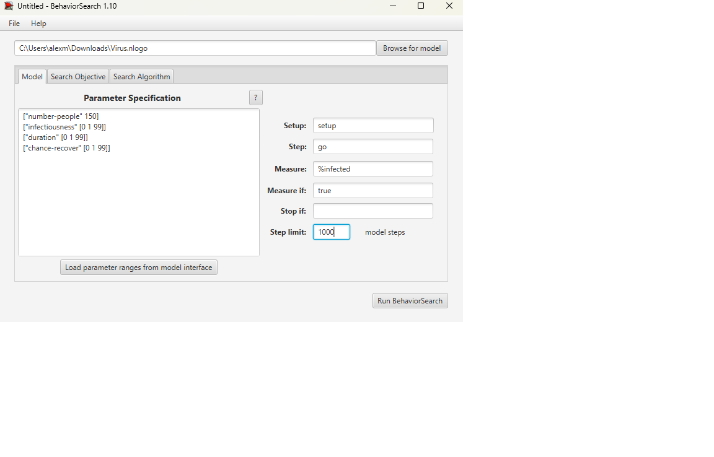
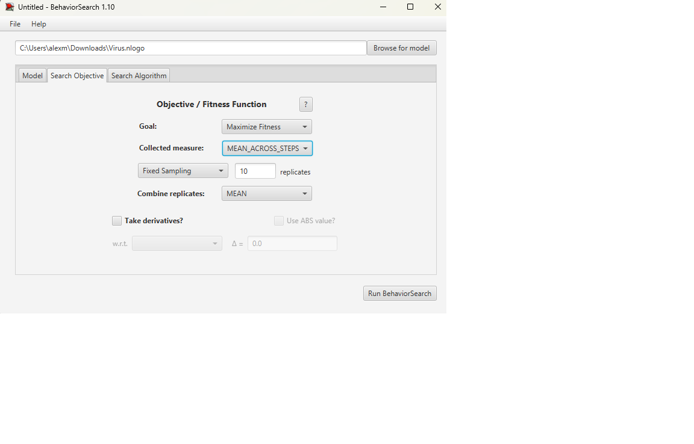
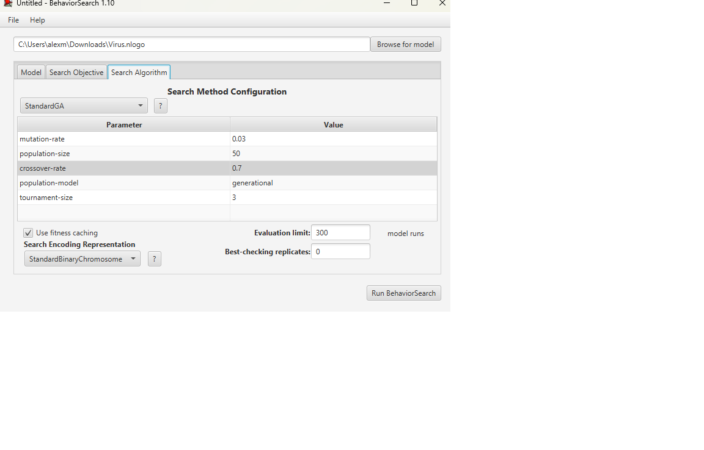
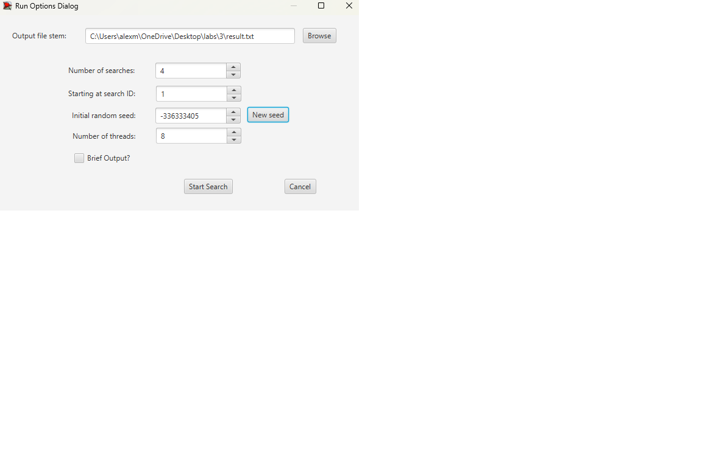
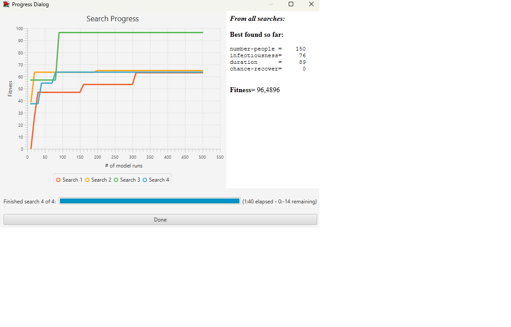
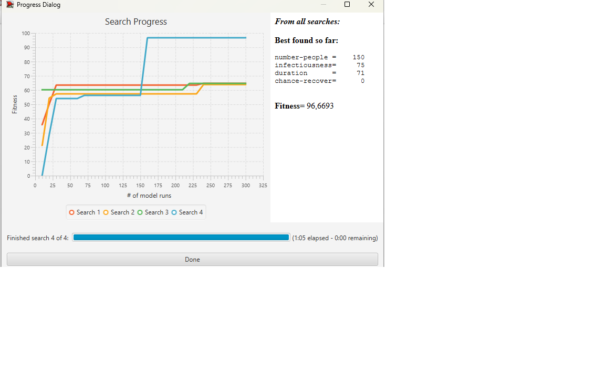

## Комп'ютерні системи імітаційного моделювання
## СПм-22-5, **Максименков Олексій**
### Лабораторна робота №**3**. Використання засобів обчислювального интелекту для оптимізації імітаційних моделей

 

### 3 Варіант, модель у середовищі NetLogo:
[Virus](http://https://www.netlogoweb.org/launch#https://www.netlogoweb.org/assets/modelslib/Sample%20Models/Biology/Virus.nlogo)

 

#### Вербальний опис моделі:

### Налаштування середовища BehaviorSearch:

**Обрана модель**:
<pre>
Virus.nlogo
</pre>
**Параметри моделі** (вкладка Model):  

<pre>
["number-people" 150]
["infectiousness" [0 1 99]]
["duration" [0 1 99]]
["chance-recover" [0 1 99]]
</pre>

Для фітнес-функції було обрано **значення відсотка хворих людей у популяції**, для її розрахунку взято глобальну змінну **%infected** з коду моделі:
<pre>
  globals
  [ %infected            ;; what % of the population is infectious
    %immune              ;; what % of the population is immune
    lifespan             ;; the lifespan of a turtle
    chance-reproduce     ;; the probability of a turtle generating an offspring each tick
    carrying-capacity    ;; the number of turtles that can be in the world at one time
    immunity-duration ]  ;; how many weeks immunity lasts
</pre>
та вказано у параметрі "**Measure**":
<pre>
%infected 
</pre>

Відсоток хворих людей у популяції має розраховуватись в середньому за весь період симуляції тривалістю, адже потрібно знайти значення для ідеального вірусу, який весь час є у максимальній кількості людей.
Параметр "**Mesure if**" встановлено зі значенням true. Параметр зупинки за умовою ("**Stop if**") не використовувався. При симуляції зі значенням **Stop if** викривлялися результати, тому він не використовувався.
Загальний вигляд вкладки налаштувань параметрів моделі:  

**Налаштування цільової функції** (вкладка Search Objective):  
Метою підбору параметрів імітаційної моделі для визначення значення "**%infected**" (відсоток хворих людей у популяції) є максимізація цього показника через параметр "**Goal**" зі значенням "**Maximize Fitness**". Це означає, що необхідно налаштувати параметри моделі так, щоб досягти максимально можливого значення "%інфікованих" в популяції, тобто знайти найпристосованіший і найживучіший вірус.

Для досягнення цієї мети, використовується параметр "**Collected measure**", який вказує спосіб обліку цього показника. У цьому випадку, встановлено значення "**MEAN_ACROSS_STEPS**". Це означає, що цікавить не просто значення "**%infected**" в певний момент симуляції, а середнє значення цього показника за весь час проведення симуляції.

Для зниження впливу випадкових факторів на результати, кожна симуляція проводиться десять разів, і після цього результат розраховується як середнє арифметичне цих десяти запусків. Це допомагає зменшити випадкові відхилення і забезпечити більш надійний результат.
Загальний вигляд вкладки налаштувань цільової функції: 

**Налаштування алгоритму пошуку** (вкладка Search Algorithm):  

Загальний вид вкладки налаштувань алгоритму пошуку:  

 

### Результати використання BehaviorSearch:
Діалогове вікно запуску пошуку :  

Результат пошуку параметрів імітаційної моделі, використовуючи **генетичний алгоритм**:  

Результат пошуку параметрів імітаційної моделі, використовуючи **випадковий пошук**:  

### Контрольні запитання
- **Навіщо потрібна оптимізаційна модель?**
Оптимізаційні моделі використовуються для пошуку найкращого рішення або рішення з набору можливих варіантів, враховуючи певні обмеження та цілі. Вони допомагають максимізувати або мінімізувати певну мету, таку як вартість, час або використання ресурсів, у складних системах.
- **Які етапи використання середовища BehaviorSearch?**
Визначення проблеми та моделі в NetLogo. -> налаштування параметру пошуку в BehaviorSearch. -> проведення пошукових експериментів.
- **Що таке цільова функція (функція пристосованості)?**
кількісно оцінює, наскільки добре дане рішення задовольняє цілям моделі. Вона керує процесом пошуку в оптимізаційних та еволюційних алгоритмах.
- **Як ви розумієте поняття "простору пошуку"?**
це множина всіх можливих рішень в задачі оптимізації. Він охоплює всі комбінації параметрів та їхні можливі значення, які може дослідити алгоритм.
- **Які алгоритми пошуку доступні у середовищі BehaviorSearch?**
Genetic Algorithms
MutationHillClimber
SimulatedAnnealing
Random Search
- **У чому полягає метод випадкового пошуку?**
це метод оптимізації, при якому рішення генеруються і оцінюються випадковим чином. Він не використовує попередню інформацію для керівництва пошуком, що робить його простим, але часто менш ефективним.
- **У чому різниця між середнім арифметичним значенням та медіаною?**
Це сума всіх значень, поділена на кількість значень. А медіана це середнє значення у відсортованому списку чисел.
- **Які можуть використовуватися критерії зупинки пошуку?**
Досягнення заданого рівня придатності. Досягнення максимальної кількості ітерацій або ліміту часу. Збіжність розв'язків, що свідчить про неможливість подальшого покращення.
- **Які основні етапи роботи генетичного алгоритму?**
Ініціалізація: Створення початкової популяції.
Оцінка: Оцінка придатності кожної особини.
Відбір: Відбір особин для розмноження.
Схрещування: Поєднання пар особин для створення потомства.
Мутація: Внесення випадкових змін до особин.
Заміна: Утворення нового покоління.
- **Які генетичні оператори вам відомі?**
Селекція: Вибір особин на основі їхньої придатності.
Кросовер (рекомбінація): Поєднання частин двох особин.
Мутація: Випадкова зміна ознак особини.
- **Що таке кросовер? Як відбувається відбір особин для нього?**
це процес поєднання генетичної інформації двох батьків для отримання потомства. Особини відбираються на основі їхньої пристосованості, часто з вищою пристосованістю мають більше шансів бути відібраними.
- **Навіщо потрібен оператор мутації?**
Мутація вводить випадкові варіації, щоб запобігти передчасній збіжності алгоритму і дослідити нові області простору пошуку.
- **Які є способи кодування варіантів рішень (особин) у генетичному алгоритмі?**
Двійкове кодування: Представлення рішень у вигляді рядків двійкових цифр.
Кодування дійсними числами: Використання дійсних чисел для представлення параметрів рішення.
Кодування перестановок: Для впорядкування задач.
- **Недоліки та переваги використання генетичних алгоритмів.**
Переваги: Добре підходять для складних, багатовимірних просторів пошуку; надійні; розпаралелюються.
Недоліки: Можуть збігатися до локальних оптимумів; обчислювально дорогі; вимагають ретельного налаштування.
- **У чому полягає алгоритм імітації відпалу?**
це алгоритм оптимізації, натхненний процесом відпалювання в металургії. Він імовірнісно приймає рішення, які гірші за поточне, щоб уникнути локальних оптимумів.
- **У чому полягає метод пошуку сходженням до вершини?**
це ітераційний алгоритм оптимізації, який починається з довільного рішення і вносить поступові зміни для покращення рішення. Він завершується, коли досягає вершини, де жодне сусіднє рішення не є кращим.